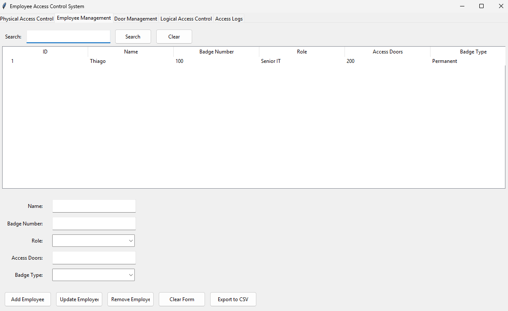
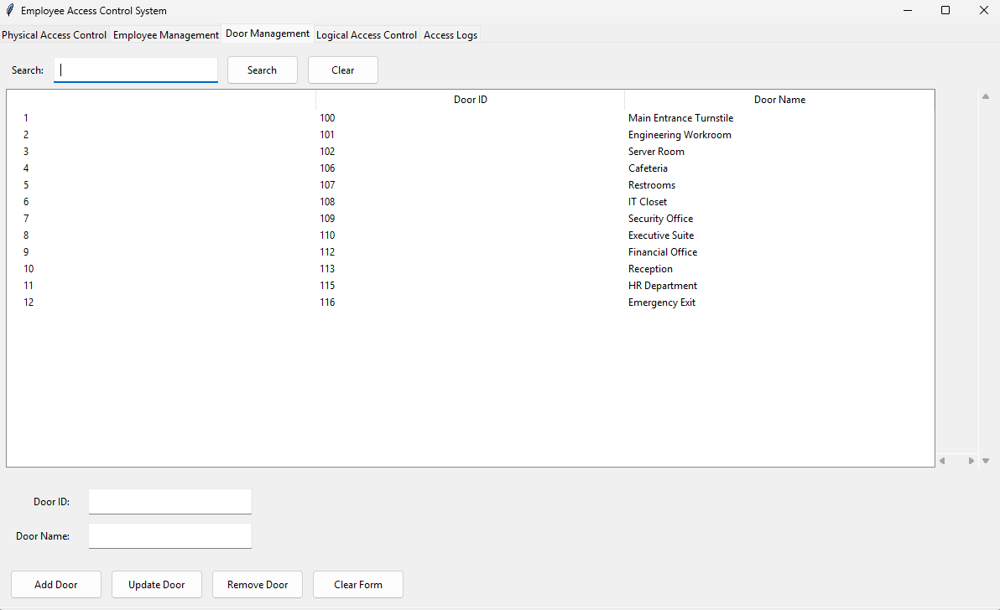
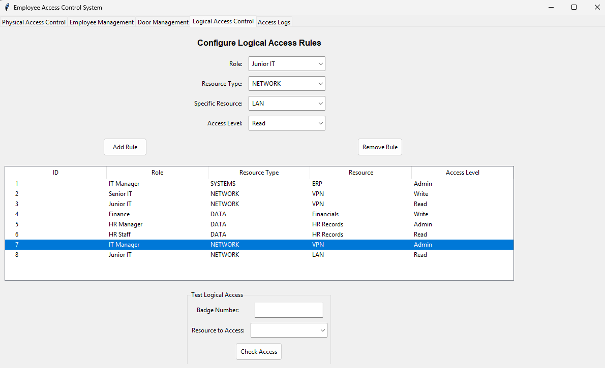

> [!WARNING]  
> **Educational Use Only - Not for Production**  
> - This is a learning tool to understand access control concepts.  
> - It lacks critical security features like authentication, encryption, and proper session management.  
> - Never use this in real applications.    

# Simple Access Control System - Learning Lab

A Python-based educational application demonstrating physical and logical access control concepts with a graphical interface. Perfect for understanding security fundamentals in a visual way.

#### Want to see more educational content? Help me keep it updated!  

### Access Control Interface - Educational Demo

<table>
  <tr>
    <td></td>
    <td></td>
    <td></td>
  </tr>
  <tr>
    <td style="text-align: center;">1- Physical Access Control</td>
    <td style="text-align: center;">2- Logical Access Control</td>
    <td style="text-align: center;">3- Access Logs & Reporting</td>
  </tr>
</table>

## ⚠️ Important Note: Learning Purpose Only

**This project is intentionally simplified for educational purposes.** 

**Real applications require more security measures!**

## 📖 Core Concepts Explained

### Authentication vs Authorization
- **Authentication**: Verifying who you are (login)
- **Authorization**: What you're allowed to do (permissions)

### Focused on Learning Authorization:
- **Authorization concepts** (access control)
- **Permission checking mechanics**
- **Role-based access patterns**

### Know What's Missing for Production:
- ❌ Authentication system
- ❌ Password security
- ❌ Session management
- ❌ Input validation
- ❌ Attack protection

## ✨ Key Features - Educational Focus

### 🔐 Physical Access Control Learning
- Manages access to physical locations (doors, turnstiles, secure areas)
- Tracks employee badge access attempts (granted/denied)
- Supports both temporary and permanent badge types
- Provides turnstile control simulation

### 💻 Logical Access Control Learning
- Controls access to digital resources (systems, networks, databases)
- Implements role-based access control (RBAC) principles
- Supports different permission levels (Read, Write, Admin)
- Tracks all logical access attempts for auditing

### 📊 Management & Reporting Learning
- Complete employee management simulation
- Door and access point configuration
- Flexible access rule setup
- Comprehensive logging of all activities
- **Data export functionality (CSV)** for analysis practice

### 🛠️ Technical Implementation
- Built with Python 3 and Tkinter for the GUI
- Uses JSON for simple data persistence
- Modular design with intuitive tabbed interface
- Responsive layout for easy administration

## 🚀 Installation & Usage

### For Learning Purposes:
1. Ensure Python 3.x is installed on your system
2. Download or clone this educational project
3. Run the application with: `python main.py`

### Educational Interface:
- **Physical Access Control Tab**: Simulate badge scans and door access
- **Employee Management Tab**: Practice user management concepts
- **Logical Access Control Tab**: Experiment with permission settings
- **Access Logs Tab**: Review simulated access attempts

## 🎯 Learning Objectives

After exploring this project, you will understand:

- Difference between physical and logical access control
- How role-based access control (RBAC) works in practice
- Basic permission management concepts
- How access logging and auditing function
- Simple GUI development for security tools

## 🔍 Access Control Concepts Demonstrated

This system implements two fundamental types of access control for educational purposes:

### Physical Access Control
Restricts entry to physical spaces like buildings and rooms. The system simulates badge validation against door permissions.

### Logical Access Control
Limits access to digital resources and data. The system demonstrates role-based rules for digital permissions.

## 📚 Next Steps in Learning

After understanding these basics, explore:

- Proper authentication systems with password hashing
- Web security frameworks (Django, Flask security extensions)
- OAuth and JWT tokens implementation
- Real-world security best practices

## 🛡️ Compliance Learning Note

This educational system demonstrates concepts that help organizations meet compliance requirements by showing:

- Audit trail capabilities
- Role-based permission structures
- Access logging principles
- Temporary access management

## 🔮 Future Educational Implementation

Planned learning enhancements:
- Rename "Employee Management" to "Physical Access Control" for clarity
- Add logging for rule creation and modifications
- Enhance simulation capabilities for different scenarios

## 👨‍💻 About the Author

**Thiago Maria** - Security Educator  
*Making security concepts accessible for beginners*

🤵🏽 [LinkedIn: thiago-cequeira-99202239](https://www.linkedin.com/in/thiago-cequeira-99202239/)  
🤗 [Hugging Face: ThiSecur](https://huggingface.co/ThiSecur)

---

> [!TIP]
> **Remember**: This is a learning tool to understand concepts. Real access control systems require proper security measures, authentication, and encryption that are beyond this educational example!
