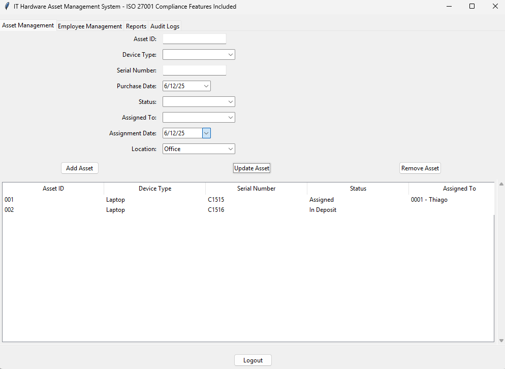
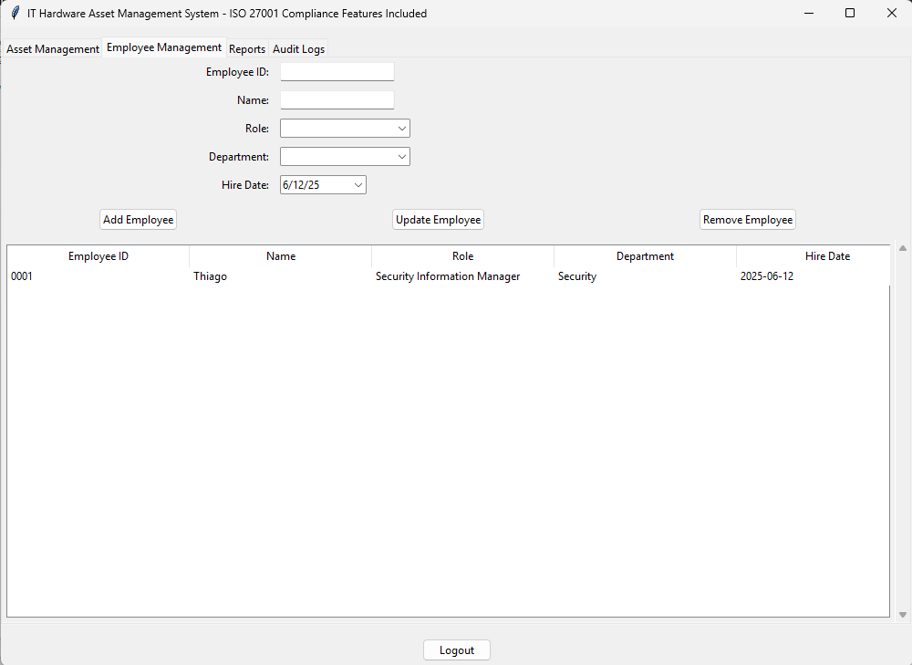
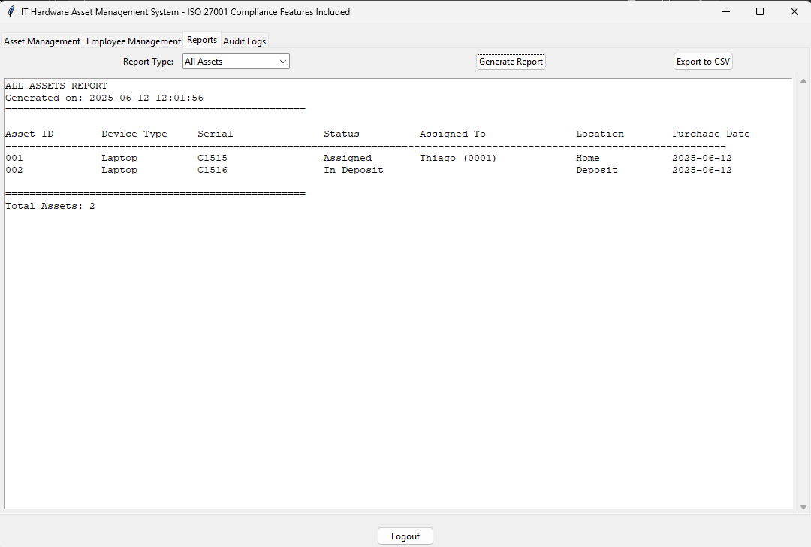
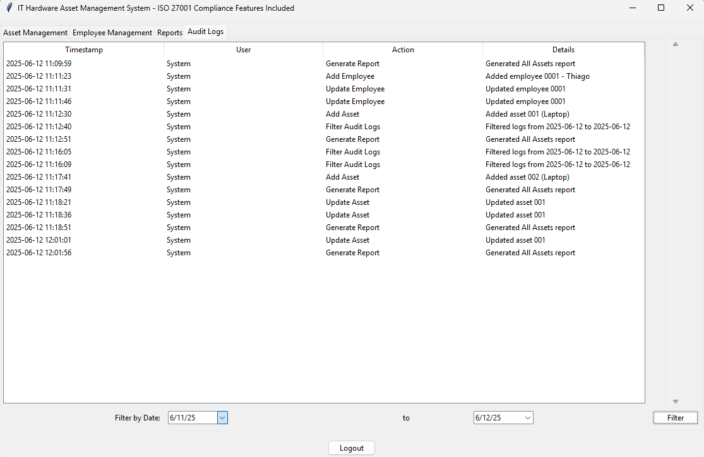

[](#)
[](#)
[](#)
[](#)


> [!NOTE]
> All content is for educational purposes only

# IT Hardware Asset Management System (ISO 27001 Compliant Features)

IT asset management involves creating and maintaining an inventory of organizational assets while tracking their usage throughout the lifecycle. This educational application demonstrates a computer-focused asset management system with ISO 27001 compliance features, including role-based device permissions and comprehensive audit logging.

<table>
  <tr>
    <td></td>
    <td></td>
    <td></td>
    <td></td>
  </tr>
  <tr>
    <td style="text-align: center;">Asset Management tab</td>
    <td style="text-align: center;">Employee Management tab</td>
    <td style="text-align: center;">Reports tab</td>
    <td style="text-align: center;">Audit Logs tab</td>
  </tr>
</table>

## Key Features

- **ISO 27001 Compliance Features**: Metadata tracking including creation date, asset owner, and security classification
- **Role-Based Device Permissions**: Strict control over device assignments based on organizational roles
- **Comprehensive Asset Tracking**: Full lifecycle management from procurement to retirement
- **Audit Logging**: Complete action tracking with timestamps for compliance demonstrations
- **Reporting Capabilities**: Multiple report formats for asset management and compliance purposes

## ISO 27001 Learning Objectives

This application demonstrates key ISO 27001 control objectives including:
- **A.8.1.1 Inventory of Assets**: Maintaining complete asset identification
- **A.8.1.2 Ownership of Assets**: Assigning clear asset ownership
- **A.8.1.3 Acceptable Use of Assets**: Defining proper asset usage through role-based permissions
- **A.8.1.4 Return of Assets**: Tracking asset return processes
- **A.12.1.2 Change Management**: Logging all asset status changes
- **A.12.4.1 Event Logging**: Comprehensive audit trail maintenance

## Role-Based Device Permissions

The system demonstrates strict device assignment rules based on employee roles, implementing the principle of least privilege:

| Role                          | Allowed Devices               |
|-------------------------------|-------------------------------|
| Attendant (Office)            | Desktop, Headset              |
| Attendant (WFH)               | Desktop, Headset              |
| Manager                       | Laptop, Smartphone            |
| Coordinator                   | Laptop, Smartphone            |
| Supervisor                    | Desktop                       |
| IT Manager                    | Laptop, Desktop               |
| IT Analyst                    | Laptop, Desktop               |
| Security Information Manager  | Laptop                        |
| Human Resources               | Desktop                       |
| Security Guard                | Walkie-Talkie                 |

## Technical Implementation

- **Frontend**: Python Tkinter for graphical interface
- **Data Storage**: JSON format for simplicity and educational clarity
- **Architecture**: Modular design with separate components for asset management, employee management, and reporting
- **Compliance Features**: Built-in audit logging and reporting capabilities

## Educational Value

This project serves as a learning tool for understanding:

1. **Asset Management Fundamentals**: Basic principles of IT asset inventory management
2. **Security Compliance**: How ISO 27001 controls translate to practical implementations
3. **Role-Based Access Control**: Implementing least privilege principles for physical assets
4. **Audit Trail Development**: Creating comprehensive logging systems for compliance
5. **Lifecycle Management**: Tracking assets from procurement to retirement

## Installation and Usage

### Requirements
- Python 3.x
- Tkinter (usually included with Python installations)

### Setup
```bash
# Clone or download the project files
python asset_management.py
```

### Usage Instructions
1. **Asset Management Tab**: Add, modify, and track hardware assets
2. **Employee Management Tab**: Manage employee records and role assignments
3. **Reports Tab**: Generate compliance and inventory reports
4. **Audit Logs Tab**: Review all system activities and changes

## Important Notes

- This is an educational demonstration tool, not a production system
- Real-world implementations require additional security measures
- ISO 27001 compliance requires organizational processes beyond technical controls
- Always consult security professionals for production implementations

## Support and Contribution

This project is maintained for educational purposes. For questions or suggestions:

[LinkedIn: Thiago Maria](https://www.linkedin.com/in/thiago-cequeira-99202239/)  
[Hugging Face: ThiSecur](https://huggingface.co/ThiSecur)

## License

MIT License - See [LICENSE](https://github.com/ThiagoMaria-SecurityIT/Python-For-Security-Information/blob/main/LICENSE) file for details

---

> [!NOTE]
> Interested in supporting additional features or role permissions?  
> [Sponsor this educational project](https://github.com/sponsors/ThiagoMaria-SecurityIT)
