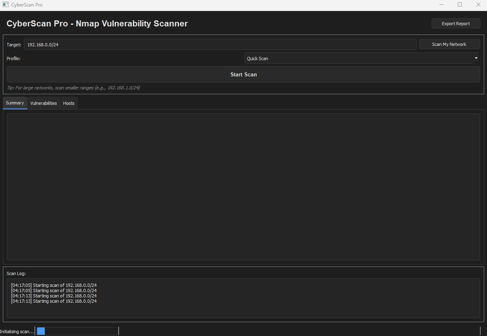

[](#) [](#)
[](#) [](#)
[](#)
  
[](https://www.linkedin.com/in/thiago-cequeira-99202239/) [](https://huggingface.co/ThiSecur) [](https://github.com/sponsors/ThiagoMaria-SecurityIT)


> [!WARNING]
> **Educational Use Only**
> This project and its code are created **for educational purposes only**. It is designed to help learners understand network security concepts, Python programming, and tool development.
> - Do not use this tool on any network without explicit permission.
> - Unauthorized scanning is illegal and unethical.
> - The author is not responsible for any misuse of this tool or information.

# CyberScan Pro - Nmap Vulnerability Scanner  

A simple, graphical interface built on top of the Nmap security scanner, perfect for learning about network reconnaissance and vulnerability assessment.  


> [!IMPORTANT]  
> **About the Example IP Addresses**  
> The IP addresses `192.168.0.1/24` and `192.168.1.0/24` shown in the screenshot are **example addresses** from standard private network ranges (RFC 1918). They are used for demonstration purposes only and are **not the real IP address**.  
>  
> This is a standard practice in cybersecurity education to protect privacy and maintain security while providing realistic examples. Always obscure real IPs in your own screenshots!    

## 📖 Table of Contents

1.  [Transparency & Philosophy](#-transparency--philosophy)
2.  [Overview](#-overview)
3.  [Features](#-features)
4.  [Target Audience](#-target-audience)
5.  [Installation](#-installation)
6.  [Usage Guide](#-usage-guide)
7.  [Understanding the Code](#-understanding-the-code-for-learners)
8.  [Best Practices & Ethics](#%EF%B8%8F-best-practices--ethics)
9.  [License](#-license)
10. [About the Author](#-about-the-author)
11. [Contributing](#-contributing)

---

## 🤝 Transparency & Philosophy

-   **📅 Repository Created:** July 2025
-   **✅ Updated:** This Readme was updated in September 2025 for the [target audience](#-target-audience) 
-   **🤖 AI-Assisted Development:** This project was initially created with the assistance of DeepSeek's AI model.
-   **👨‍💻 Human-Refined:** The AI-generated code was meticulously reviewed, refined, and secured by human developers.

**Why This Matters:**
This project serves as a practical case study in AI-assisted development. The key takeaway is that **while AI is powerful for generating functional code quickly, the initial output often lacks critical security best practices and robust error handling.**

This code was reviewed to ensure:
-   **Security:** Input validation and safe command execution.
-   **Correctness:** Proper error handling and edge case management.
-   **Readability:** Clear structure and comments for educational purposes.

This demonstrates the essential role of human expertise in reviewing and hardening AI-generated code before it can be considered production-ready.

## 🧭 Overview

CyberScan Pro is a simple GUI wrapper for the Nmap security scanner. It provides a visual way to run scans and view results, making it an excellent tool for students learning about cybersecurity auditing and Python development.

**Educational Purpose:** To demonstrate how security tools work, how to build interfaces for command-line tools, and the importance of code review in AI-assisted projects.

## ✨ Features

-   **🎯 Automatic Network Detection:** See how tools find local network ranges.
-   **🔍 Basic Scanning:** Run quick or full scans with a click.
-   **📊 Interactive Results:** View results in a simple, tabbed interface.
-   **📁 Multi-Format Reporting:** Export results to HTML, JSON, or TXT.
-   **⚡ Simple Design:** Easy-to-understand interface for learners.

## 🎯 Target Audience

This project is ideal for:
1.  **Cybersecurity Students:** Learning the basics of network scanning.
2.  **Python Developers:** Wanting to understand GUI development and subprocess management.
3.  **IT Beginners:** Looking for a visual introduction to tools like Nmap.

## 💻 Installation

### Prerequisites:
-   Python 3.8+
-   `nmap` installed on your system.
-   A virtual lab environment for safe testing.

### Steps:
1.  Clone or download the project files.
2.  Install the required Python dependencies.
    ```bash
    pip install -r requirements.txt
    ```

## 🚀 Usage Guide

### Running the Scanner:
```bash
python nmap-vulnerability-scanner.py
```

### Learning Exercise:
1.  Use the **"Scan My Network"** button for automatic detection.
2.  Select a scan profile and click **"Start Scan"**.
3.  Explore the different tabs to see how results are organized.
4.  Use the **"Export Report"** button to see how data can be saved in different formats.

## 🔍 Understanding the Code (For Learners)

Key areas to study in the source code:
-   **`run_nmap_scan()` Function:** See how the program runs Nmap commands.
-   **Nmap Parser:** Look for the code that reads and interprets Nmap's output.
-   **GUI Structure (`tkinter`):** See how the simple interface is built.
-   **Error Handling:** Look for `try` and `except` blocks added during the review process.

## ⚠️ Best Practices & Ethics

This project is a learning tool. Always follow these ethical guidelines:
1.  **Permission is Required:** Only scan networks you own or have permission to test.
2.  **Use a Lab Environment:** Practice on virtual machines, not real networks.
3.  **Understand the Laws:** Unauthorized scanning is illegal.

## 📜 License

This project is licensed under the MIT License - see the [LICENSE](LICENSE) file for details.

---

## 👨‍💼 About the Author

**Thiago Maria - From Brazil to the World 🌎**
*Security Professional | Python Developer | AI Enthusiast*

I share projects to help others learn about cybersecurity, Python, and responsible AI development.  

**Connect:**  
[](https://www.linkedin.com/in/thiago-cequeira-99202239/)  
[](https://huggingface.co/ThiSecur)  

---

## 🤝 Contributing

**Contributions are welcome!** This is a great project for beginners to contribute to. Please submit issues or pull requests for improvements.

**Ways to Contribute:**
[](https://github.com/sponsors/ThiagoMaria-SecurityIT)
